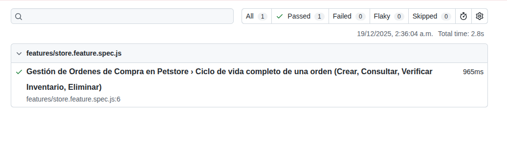

# Petstore API Automation  🚀

Proyecto de automatización de pruebas para la API de Petstore utilizando **Playwright**, **TypeScript** y **Gherkin (BDD)**.

## 📋 Prerrequisitos

- Node.js (v18 o superior)
- NPM

## 🛠️ Instalación y Configuración

Sigue estos pasos para levantar el proyecto en tu máquina local:

1.  **Clonar el repositorio:**
    ```bash
    git clone https://github.com/jhontesterqa-ops/reto2-jho.git
    cd reto2JHO
    ```

2.  **Instalar dependencias:**
    ```bash
    npm install
    ```
    > Esto descargará Playwright y todas las librerías necesarias definidas en `package.json`.

3.  **Instalar navegadores de Playwright (necesario para el runner):**
    ```bash
    npx playwright install
    ```

## 🧪 Ejecución de Pruebas

### 1. Generación de Tests BDD
Antes de correr las pruebas, debemos traducir los archivos `.feature` (Gherkin) a archivos de prueba ejecutables.

```bash
npx bddgen

ejemplo de test ejecutado

